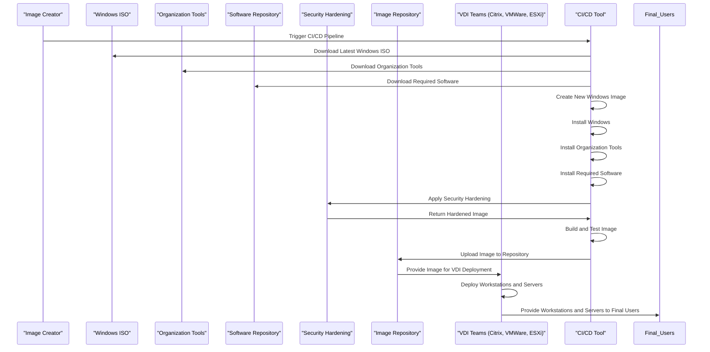

# Windows Image Pipeline
Pipeline to create Windows images with each process involved.

## Participants
#### Image Creator
The person or team responsible for triggering the CI/CD pipeline to create a new Windows image.

#### Windows ISO
The source of the Windows operating system installation media.

#### Organization Tools
The repository of organization-specific tools and software.

#### Software Repository
The repository of required software applications.

#### Security Hardening
The process of applying security configurations and patches to the image.

#### Image Repository
The storage location for the final Windows image.

#### VDI Teams
The teams responsible for deploying the Windows image to virtual desktop infrastructure (VDI) environments.

#### CI/CD Tool
The tool responsible for managing the entire process, from downloading components to deploying the final image.

## Process
The process involves creating a new Windows image, installing organization tools and software, applying security hardening, building and testing the image, and deploying it to the image repository for VDI teams to use.

## Processes with explanations
### 1. Trigger CI/CD Pipeline
#### The Image Creator triggers the CI/CD pipeline to start the process of creating a new Windows image.

### 2. Download Windows ISO
#### The CI/CD tool downloads the latest Windows ISO from the Windows ISO participant.

### 3. Download Organization Tools
#### The CI/CD tool downloads the necessary organization tools from the Organization Tools participant.

### 4. Download Required Software
#### The CI/CD tool downloads the required software applications from the Software Repository participant.

### 5. Create New Windows Image
#### The CI/CD tool creates a new Windows image using the downloaded components.

### 6. Install Windows
#### The CI/CD tool installs the Windows operating system on the new image.

### 7. Install Organization Tools
#### The CI/CD tool installs the organization tools on the new image.

### 8. Install Required Software
#### The CI/CD tool installs the required software applications on the new image.

### 9. Apply Security Hardening
#### The CI/CD tool applies security configurations and patches to the image using the Security Hardening participant.

### 10. Build and Test Image
#### The CI/CD tool builds and tests the final image to ensure it is ready for deployment.

### 11. Upload Image to Repository
#### The CI/CD tool uploads the final image to the Image Repository participant.

### 12. Provide Image for VDI Deployment
#### The Image Repository participant provides the final image to the VDI Teams participant for deployment to VDI environments.